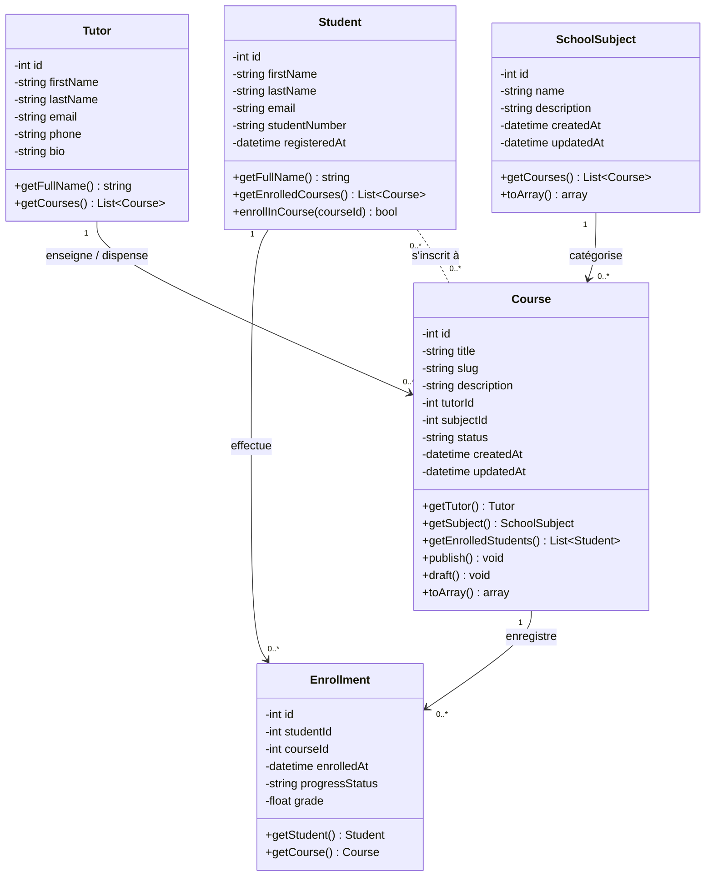

```mermaid
classDiagram
    direction TB

    class Tutor {
        -int id
        -string firstName
        -string lastName
        -string email
        -string phone
        -string bio
        +getFullName() string
        +getCourses() List~Course~
    }

    class SchoolSubject {
        -int id
        -string name
        -string description
        -datetime createdAt
        -datetime updatedAt
        +getCourses() List~Course~
        +toArray() array
    }

    class Course {
        -int id
        -string title
        -string slug
        -string description
        -int tutorId
        -int subjectId
        -string status
        -datetime createdAt
        -datetime updatedAt
        +getTutor() Tutor
        +getSubject() SchoolSubject
        +getEnrolledStudents() List~Student~
        +publish() void
        +draft() void
        +toArray() array
    }

    class Student {
        -int id
        -string firstName
        -string lastName
        -string email
        -string studentNumber
        -datetime registeredAt
        +getFullName() string
        +getEnrolledCourses() List~Course~
        +enrollInCourse(courseId) bool
    }

    class Enrollment {
        -int id
        -int studentId
        -int courseId
        -datetime enrolledAt
        -string progressStatus
        -float grade
        +getStudent() Student
        +getCourse() Course
    }

    Tutor "1" --> "0..*" Course : enseigne / dispense
    SchoolSubject "1" --> "0..*" Course : catégorise

    Student "1" --> "0..*" Enrollment : effectue
    Course "1" --> "0..*" Enrollment : enregistre
    Student "0..*" .. "0..*" Course : s'inscrit à
```